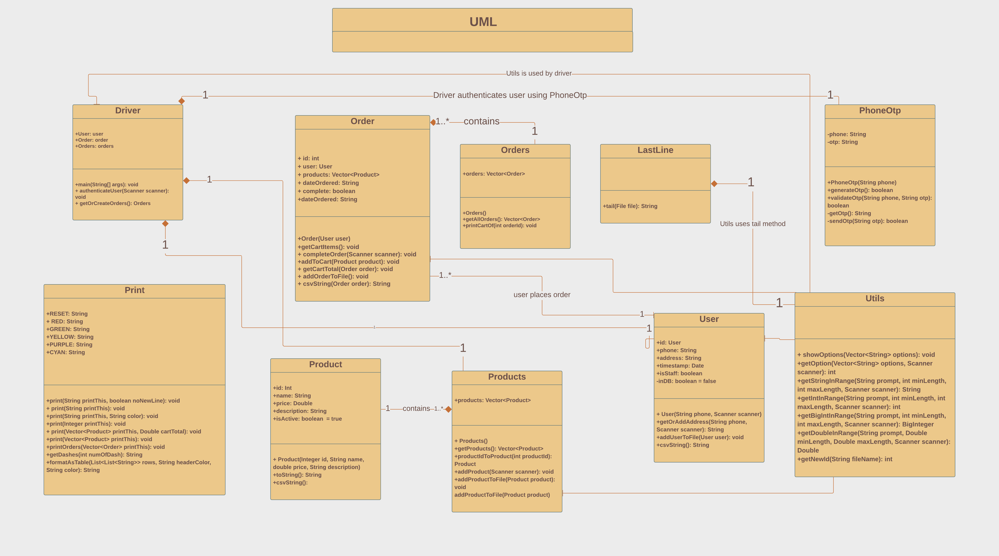
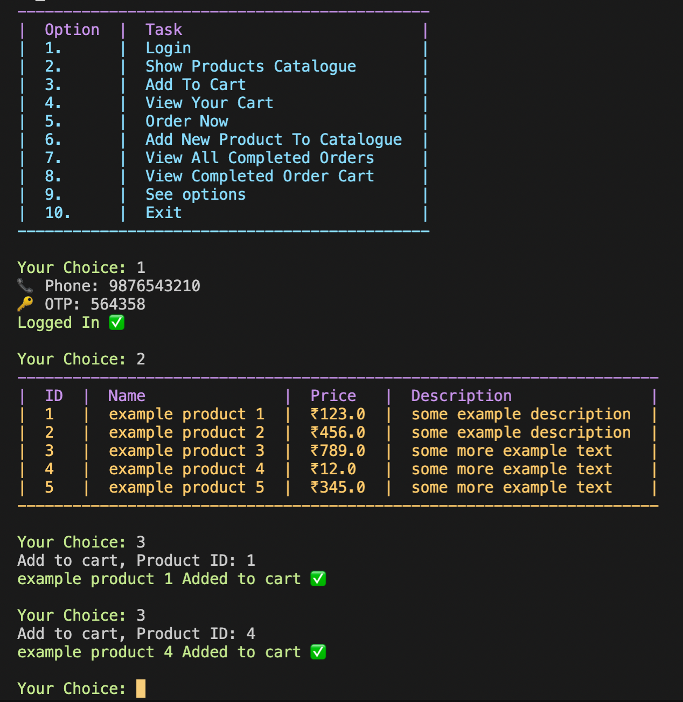
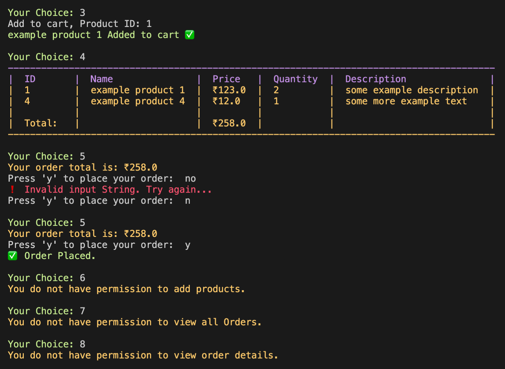
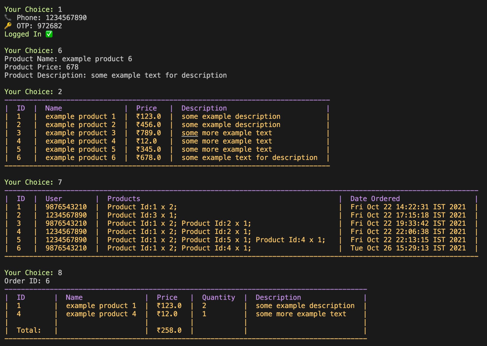

# Java E-Commerce CLI

## Class diagram



## Usage

### Clone repo

```
git clone git@github.com:pettiboy/java-ecommerce-cli.git
cd java-ecommerce-cli
```

### Run code

run the main method in `src/Driver.java`

## Demo





## Contributing

```
git add src
git commit -m "descriptive commit message"
git push
```
